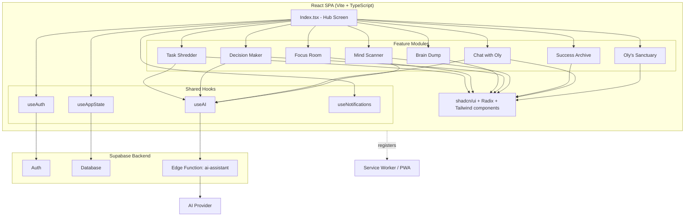

# Onward 🚀

**Onward** is a friendly, ADHD-aware productivity companion. Instead of a plain to-do list, it breaks your day into small, low-friction "modules" and pairs you with **Oly**, a virtual buddy that helps you focus, decide, and celebrate wins along the way.

🔗 **Live app:** [onwardapp.ir](https://onwardapp.ir)

---

## ✨ Features

- **Task Shredder** — turns a big, overwhelming goal into a checklist of tiny, doable steps.
- **Focus Room** — visual focus timer sessions with Oly by your side.
- **Brain Dump** — instantly capture everything on your mind, then send items straight to the Task Shredder.
- **Decision Maker** — can't choose? Let Oly pick your next move for you.
- **Mind Scanner** — a quick check-in on your mental/energy level.
- **Success Archive** — a record of your focus minutes and completed tasks.
- **Chat with Oly** — a conversational AI buddy for quick motivation or advice.
- **Oly's Sanctuary** — spend "feathers" (earned through focus & tasks) to decorate Oly's home.
- **Accounts & sync** — sign in and keep your progress backed up with Supabase.
- **Installable PWA** — works offline-ready and can be installed like a native app.

## 🛠️ Tech Stack

| Layer | Technology |
|---|---|
| Frontend | [React](https://reactjs.org/) + [Vite](https://vitejs.dev/) + TypeScript |
| Styling / UI | [Tailwind CSS](https://tailwindcss.com/), [shadcn/ui](https://ui.shadcn.com/), [Radix UI](https://www.radix-ui.com/) |
| Animation | [Framer Motion](https://www.framer.com/motion/) |
| Data / state | [TanStack Query](https://tanstack.com/query), React Hooks |
| Auth & Backend | [Supabase](https://supabase.com/) (Auth, Database, Edge Functions) |
| AI | Supabase Edge Function (`ai-assistant`) → [OpenRouter](https://openrouter.ai) (free tier) |
| Charts | [Recharts](https://recharts.org/) |
| PWA | [vite-plugin-pwa](https://vite-pwa-org.netlify.app/) |
| Deployment | [Vercel](https://vercel.com/) |

## 🧭 Architecture

The app is a single-page React app. A central hub screen (`Index.tsx`) switches between self-contained "modules," while shared hooks handle local app state, authentication, and notifications. AI-powered modules call a single Supabase Edge Function that talks to the AI provider.



## 🚀 Getting Started

### Prerequisites
- [Node.js](https://nodejs.org/) 18+ (or [Bun](https://bun.sh/), since the repo ships a `bun.lockb`)
- A [Supabase](https://supabase.com/) project (URL + anon key) for auth, database, and the `ai-assistant` edge function

### Installation

```bash
# Clone the repository
git clone https://github.com/hamidcode95/onwardapp.git
cd onwardapp

# Install dependencies
npm install
# or, if you prefer Bun:
bun install
```

### Environment variables

Create a `.env` file in the project root with your Supabase credentials:

```env
VITE_SUPABASE_URL=your-supabase-project-url
VITE_SUPABASE_ANON_KEY=your-supabase-anon-key
```

The frontend never needs an AI provider key — see below.

### 🤖 AI Provider

AI features (Task Shredder, Mind Scanner, Decision Maker, Chat with Oly) are
powered by a single Supabase Edge Function, `ai-assistant`, which is the only
part of the codebase that talks to an AI provider:

```
React (useAI hook) → Supabase Edge Function (ai-assistant) → AI provider
```

The provider itself is swappable via **secrets only** — no code changes
needed to switch providers or models. The Edge Function reads:

| Secret | Purpose | Current value |
|---|---|---|
| `AI_PROVIDER` | Which provider branch to use | `openrouter` (optional — this is the default if unset) |
| `AI_MODEL` | Model ID to request | `nvidia/nemotron-3-ultra-550b-a55b:free` (optional — this is the default if unset) |
| `OPENROUTER_API_KEY` | Your OpenRouter API key | **required** |

**Current provider:** [OpenRouter](https://openrouter.ai) — chosen because it
offers genuinely free models with no credit card required, which direct
provider APIs (Gemini, DeepSeek, OpenAI, Anthropic) generally do not from
every region, and some are entirely inaccessible from certain countries due
to export restrictions.

**Current model:** `nvidia/nemotron-3-ultra-550b-a55b:free` — NVIDIA Nemotron
3 Ultra, a free, open-weight, frontier-class reasoning model on OpenRouter's
free tier (1M context, no cost). Always re-check
[OpenRouter's free models list](https://openrouter.ai/models?fmt=free)
before assuming this ID is still valid — free model availability rotates.

**These keys are server-side only.** They live in Supabase Edge Function
secrets and are never sent to, or readable by, the browser. Do **not** add
`VITE_OPENROUTER_API_KEY` or any provider key to the frontend `.env`.

#### Setting it up

1. Create a free account at [openrouter.ai](https://openrouter.ai) and
   generate an API key under **Keys**.
2. In the Supabase Dashboard, go to **Edge Functions → ai-assistant →
   Manage secrets** and add:
   - `OPENROUTER_API_KEY` = the key from step 1
   - (optional) `AI_MODEL` if you want to override the default above
   - (optional) `AI_PROVIDER` — only needed once a second provider branch
     exists in `callAI()`
3. No redeploy is required after changing secrets — they're read at request
   time via `Deno.env.get(...)`.

#### Known limitations

- Free OpenRouter models are rate-limited and intended for development/MVP/
  early-user traffic, not guaranteed production-scale throughput.
- Free model availability and exact IDs can change; if AI features start
  failing, check the Edge Function logs first (Supabase Dashboard → Edge
  Functions → ai-assistant → Logs) — the client only ever sees a generic
  "AI Error" toast by design, so the real cause is always server-side.
- To switch providers later (e.g. add a paid fallback), add a new `case` in
  `callAI()` inside `supabase/functions/ai-assistant/index.ts` — the rest of
  the function, and the entire frontend, needs no changes.

### Run locally

```bash
npm run dev
```

The app will be available at `http://localhost:5173` (default Vite port).

### Build for production

```bash
npm run build
```

### Preview the production build

```bash
npm run preview
```

## 📁 Project Structure

```
onwardapp/
├── public/              # Static assets, PWA service worker
├── src/
│   ├── components/      # Reusable UI components (GlassCard, Oly, etc.)
│   ├── hooks/            # useAppState, useAuth, useAI, useNotifications
│   ├── integrations/     # Supabase client setup
│   ├── modules/          # Feature modules (Task Shredder, Focus Room, ...)
│   ├── pages/             # Route-level pages (Index, Auth, NotFound)
│   ├── App.tsx
│   └── main.tsx
├── supabase/
│   ├── config.toml
│   └── functions/
│       └── ai-assistant/  # Edge function powering AI features
└── vite.config.ts
```

## 🌐 Deployment

The project is configured for deployment on [Vercel](https://vercel.com/).

**Live demo:** [https://onwardapp.ir](https://onwardapp.ir)

## 🤝 Contributing

Issues and pull requests are welcome! If you'd like to propose a significant change, please open an issue first to discuss what you'd like to change.

## 📄 License

No license has been specified yet for this project.
